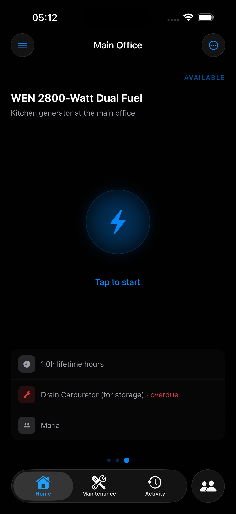
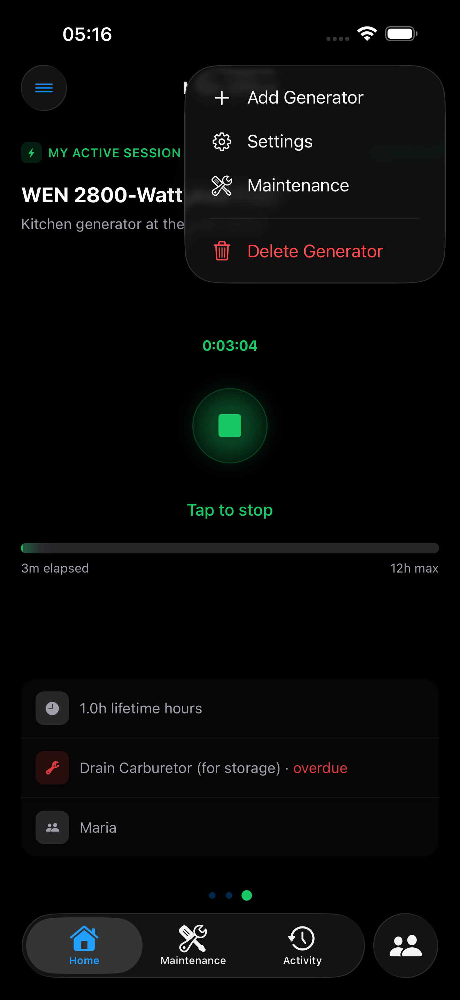
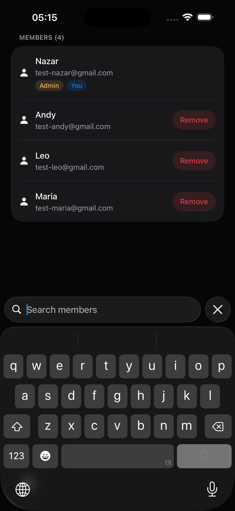
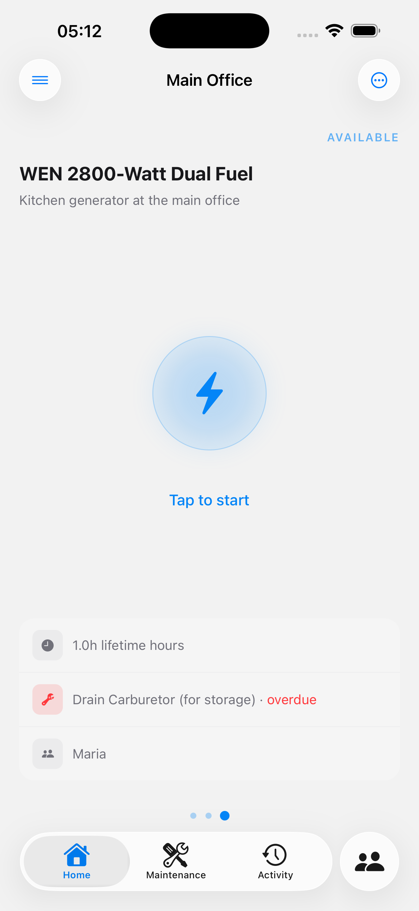
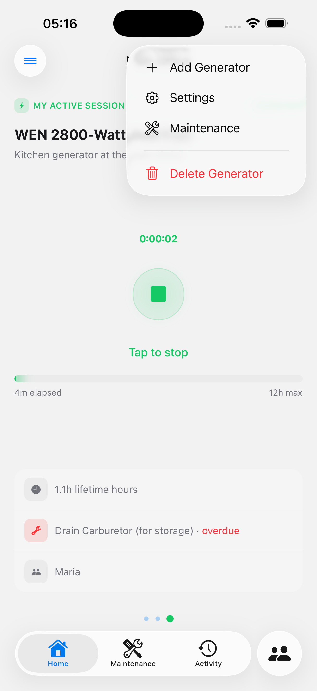
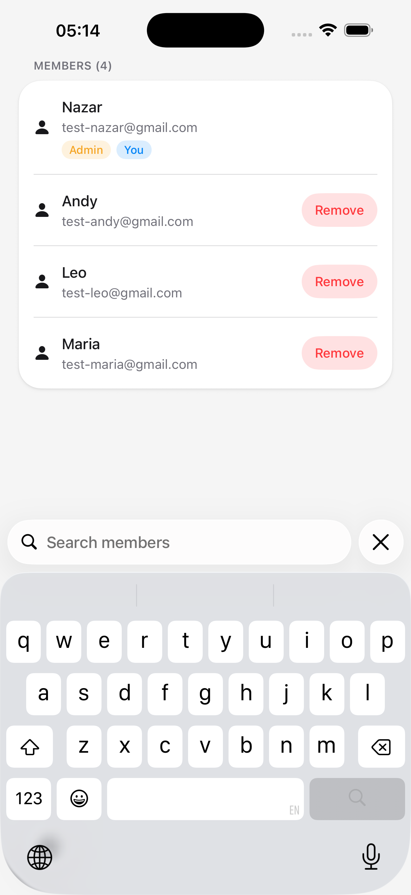

# Svitlo

**Svitlo** (Ukrainian: "світло" — *light / electricity*) is an offline-first iOS app for tracking power generator runtime, scheduling maintenance with AI, and coordinating generators across teams — built for people who depend on generators when the grid goes down.

> **[PowerSync AI Hackathon](https://www.powersync.com/blog/powersync-ai-hackathon-8k-in-prizes) submission** — competing for Best Neon Project, Best Mastra AI Project, and Best Local-First Submission.

<p align="center">
  
  &nbsp;&nbsp;
  
  &nbsp;&nbsp;
  
</p>
<p align="center">
  
  &nbsp;&nbsp;
  
  &nbsp;&nbsp;
  
</p>

**Website:** [svitlo.expo.app](https://svitlo.expo.app) · **Demo Video:** [YouTube](https://youtu.be/3goWDzY37dE)

---

## The Problem

Since Russia's attacks on Ukraine's energy infrastructure, millions of Ukrainians rely on portable generators to power homes, businesses, hospitals, and schools during rolling blackouts that can last 10+ hours a day. The same reality applies to construction sites, farms, and off-grid communities worldwide.

Yet generator maintenance is universally tracked with pen and paper — or not at all. People miss oil changes, don't know their generator's total runtime, and have no way to coordinate refueling across a team. When maintenance gets neglected, generators fail at the worst possible moment: during a blackout.

**Svitlo exists because knowing when your generator needs oil shouldn't require cell service.**

## What Svitlo Does

- **One-tap session tracking** — start/stop the generator, automatic hour logging
- **AI-generated maintenance plans** — enter your generator model and get manufacturer-specific schedules (oil changes, filter replacements, spark plug swaps) via a Mastra AI agent that searches real manuals
- **Smart maintenance alerts** — tracks hours-based, calendar-based, and whichever-comes-first intervals with overdue/due-soon/upcoming urgency levels
- **Generator health modeling** — monitors consecutive run hours, enforces rest periods, warns at configurable thresholds with a real-time state machine (Available → Running → Resting)
- **Team coordination** — organizations with admin/member roles, email invitations, per-generator user assignments
- **100% offline operation** — every feature works without internet; data syncs bidirectionally when connectivity returns

---

## How PowerSync Powers Svitlo

PowerSync is the backbone of Svitlo's offline-first architecture — not a thin persistence layer, but the system that makes the app genuinely usable without connectivity.

### Bidirectional Sync with Instant Local Writes

All reads and writes hit a **local SQLite database** (OP-SQLite) on the device. PowerSync syncs changes bidirectionally to Neon Postgres in the background. Users never wait for a network round-trip — starting a generator, logging maintenance, or inviting a team member all happen instantly against the local database and sync when possible.

### Sync Streams with Priority-Based Download Ordering

Svitlo defines **10 named Sync Streams** with priority ordering so the initial sync delivers data in FK-safe order:

| Priority | Streams | Purpose |
|----------|---------|---------|
| 1 (first) | `user_data`, `org_data` | Identity and organization context must arrive first — all other data has foreign keys to these |
| 2 | `org_members_data`, `invitation_data`, `generator_data`, `assignment_data` | Organizational structure and generator registry |
| 3 (last) | `session_data`, `template_data`, `record_data`, `peer_users` | Operational data — sessions, maintenance history, team member details |

Each stream uses **parameterized SQL WITH clauses** to compute user context (admin orgs, member orgs, assigned generators) once, then efficiently filters all joins against that context. For example, org admins see all generators in their organizations, while regular members only see generators they're assigned to — all enforced at the sync layer.

### Upload Queue with SQLSTATE Error Categorization

The sync connector extracts **PostgreSQL SQLSTATE codes** from upload failures and routes them:

- **Constraint violations** (Class 23: unique, FK, check) and **trigger exceptions** (P0001) → non-recoverable. Operation is discarded from the queue, rejection surfaced to the user with the constraint name and table
- **Network errors** (Class 08, timeouts, ECONNREFUSED) → recoverable. Operation stays in queue, PowerSync retries with backoff
- **Auth errors** (403, expired tokens) → credential cache cleared, session refresh triggered

This prevents a single bad write from permanently stalling the entire upload queue — critical for offline-first apps where operations can queue up for hours.

### Multi-User Real-Time Sync

When teams share generators, PowerSync keeps every member's local database consistent. One person starts a generator, another sees the running status update — even if they were offline when it happened. Session history, maintenance records, and member changes all flow through the same sync pipeline with row-level authorization.

### Initial Sync Gate with Progress

On first launch, Svitlo shows download progress as a percentage (`downloadedFraction`) while PowerSync streams data in priority order. After 15 seconds, an emergency sign-out button appears in case of connection issues. Once `hasSynced` flips to true (persisted in SQLite), the gate never shows again — even across app restarts.

---

## AI-Powered Maintenance with Mastra

Svitlo uses [**Mastra**](https://mastra.ai) to run an AI agent that generates manufacturer-specific maintenance plans. This isn't a simple prompt-and-response — it's an autonomous agent with tool access that researches real maintenance data.

### The Agent

```
Agent: "Maintenance Researcher"
Model: Google Gemini 2.5 Flash (via @ai-sdk/google)
Tool:  Google Search — searches the web for official maintenance manuals
```

The agent is configured as a power generator maintenance expert. Given a generator's make and model, it:

1. **Searches the web** for the manufacturer's official maintenance manual using the `googleSearch` tool
2. **Extracts structured maintenance schedules** — oil change intervals, filter replacements, spark plug service, cooldown requirements
3. **Returns validated JSON** matching a strict Zod schema with task names, trigger types, hour/calendar intervals, and source URLs
4. **Determines safe operating limits** — max consecutive run hours and required cooldown periods based on real manufacturer data
5. **Supports localization** — returns maintenance task names in Ukrainian or English based on user locale, while always searching in English for better results

### Structured Output with Zod Validation

The agent uses Mastra's `structuredOutput` with `jsonPromptInjection: true` to force Gemini into strict JSON mode. The response is validated against a Zod schema that enforces trigger type consistency:

- `hours` trigger → requires `triggerHoursInterval`, rejects `triggerCalendarDays`
- `calendar` trigger → requires `triggerCalendarDays`, rejects `triggerHoursInterval`
- `whichever_first` → requires both intervals

### Intelligent Repair & Fallback

AI responses don't always match the schema perfectly. Svitlo's `repairTasks()` function fixes common issues:

- Missing hour interval on `whichever_first` → computed from calendar days assuming 8 hours/day of operation
- Missing calendar days → computed from hours or defaults to 90 days
- Incompatible trigger type/field combinations → downgraded to a valid type

When the AI fails entirely (network error, rate limit, obscure generator model), a `genericFallback()` returns conservative industry-standard defaults (oil check at 20h, oil change at 100h/180 days, air filter at 200h/365 days, spark plug at 300h) — so users **always** get a working maintenance plan, even offline.

### End-to-End Flow

```
User enters generator model → RPC call (ORPC, protected by session auth)
→ Mastra agent generates with Gemini 2.5 Flash + Google Search tool
→ Zod schema validation → repairTasks() fixes edge cases
→ Response sent to client → user reviews and applies
→ createGeneratorWithMaintenance() writes to local SQLite in one transaction
→ PowerSync syncs generator + maintenance templates to Neon Postgres
```

---

## Neon as the Server-Side Foundation

[**Neon**](https://neon.tech) Postgres is the authoritative backend database — the source of truth that PowerSync replicates from and the enforcement layer for all business rules.

### Serverless HTTP Driver

Svitlo uses Neon's **serverless HTTP driver** (`@neondatabase/serverless`) for edge-compatible, connection-pooled database access. No persistent TCP connections — every query is a stateless HTTP request, ideal for serverless API routes on EAS Hosting:

```typescript
import { neon } from '@neondatabase/serverless'
const client = neon(env.DATABASE_URL)
export const db = drizzle({ client, schema })
```

### Schema with Business Logic in the Database

Neon hosts 9 tables across auth, organizations, generators, and maintenance domains. Beyond standard schema, Svitlo pushes business logic into PostgreSQL itself:

**Check constraints** enforce data integrity at the row level:
- Generator `maxConsecutiveRunHours > 0`, `requiredRestHours > 0`, `runWarningThresholdPct` between 1-100
- Maintenance template `triggerHoursInterval > 0`, `triggerCalendarDays > 0`
- Non-empty strings for names, emails, task names

**Trigger functions** enforce rules too complex for CHECK constraints:
- `validate_maintenance_template_trigger_fields()` — ensures the correct interval fields are populated based on `triggerType` (e.g., `whichever_first` requires both `triggerHoursInterval` AND `triggerCalendarDays`). Raises `P0001` on violation
- `validate_org_admin_immutable()` — prevents `adminUserId` from being changed after organization creation, using `IS DISTINCT FROM` for null-safe comparison

**Foreign key strategies** are deliberate:
- **CASCADE** for ownership (deleting an org cascades to its generators, members, invitations)
- **RESTRICT** on `organizations.adminUserId` (prevents deleting a user who owns an org)
- **NO ACTION** on session/record user attribution (preserves audit trail even if the user leaves)

**Unique partial index** enforces one active session per generator:
```sql
CREATE UNIQUE INDEX ON generator_sessions (generator_id) WHERE stopped_at IS NULL;
```

### Neon-Specific Error Handling

The PowerSync write handler catches `NeonDbError` from the serverless driver and extracts SQLSTATE codes for intelligent error routing:

```typescript
import { NeonDbError } from '@neondatabase/serverless'

// Class 22 (data exceptions), Class 23 (constraint violations), P0001 (trigger errors)
→ returned as structured rejections with code, message, constraint name, and table
→ PowerSync client discards the operation and surfaces the rejection to the user
```

### 3-Layer Validation Architecture

Neon is the final enforcement layer in a 3-layer validation stack designed for offline-first correctness:

1. **Client Zod schemas** — field-level constraints, immediate UX feedback (runs offline)
2. **Client mutations** — authorization checks, FK existence, cross-table business rules (runs offline)
3. **Neon PostgreSQL constraints + triggers** — final safety net, enforced even if client validation is bypassed or has a bug

Redundancy is intentional: the client validates for responsiveness, the server enforces for security.

### PowerSync Replication

PowerSync connects to Neon via PostgreSQL replication protocol (`sslmode: verify-full`) and streams changes through 10 sync configs with row-level SQL filtering — effectively implementing row-level security at the sync layer rather than in Postgres directly. This means each user's device only receives the rows they're authorized to see.

---

## Architecture

```
┌─────────────────────┐       ┌──────────────┐       ┌──────────────┐
│   iOS App (Expo)    │       │  PowerSync   │       │    Neon      │
│                     │◄─────►│    Cloud     │◄─────►│  Postgres    │
│  OP-SQLite (local)  │ sync  │  10 streams  │  repl │  9 tables    │
│  Drizzle queries    │       │  3 priorities │       │  2 triggers  │
└─────────────────────┘       └──────────────┘       └──────────────┘
                                                            ▲
                                                            │ HTTP (serverless)
                                                     ┌──────┴───────┐
                                                     │  EAS Hosting │
                                                     │  Expo API    │
                                                     │  ORPC routes │
                                                     │  Better Auth │
                                                     │  Mastra AI   │
                                                     └──────────────┘
```

### Generator Status State Machine

Svitlo computes generator status in real-time by walking session history locally:

- **Available** → ready to start
- **Running** → active session, tracking consecutive hours, warning at configurable threshold
- **Resting** → mandatory cooldown after extended run, countdown to availability

No polling. No server calls. Pure local computation from synced session data.

## Tech Stack

| Layer | Technology |
|-------|-----------|
| Framework | [Expo](https://expo.dev) (SDK 55) + [Expo Router](https://docs.expo.dev/router/introduction/) |
| Language | TypeScript |
| UI | [HeroUI Native](https://herouinative.com) + [Tailwind CSS v4](https://tailwindcss.com) via [Uniwind](https://uniwind.dev) |
| Local DB | [OP-SQLite](https://github.com/nicksrandall/op-sqlite) |
| Sync | [PowerSync](https://www.powersync.com) Cloud (Sync Streams, edition 3) |
| Server DB | [Neon](https://neon.tech) Serverless Postgres + [Drizzle ORM](https://orm.drizzle.team) |
| Auth | [Better Auth](https://www.better-auth.com) (Apple Sign In) |
| AI | [Mastra](https://mastra.ai) agent + [Google Gemini 2.5 Flash](https://ai.google.dev) with Google Search tool |
| API | [ORPC](https://orpc.dev) (end-to-end type-safe RPC) |
| Validation | [Zod](https://zod.dev) (client + AI output + server) |
| Hosting | [EAS Hosting](https://docs.expo.dev/eas/) (API routes) |
| i18n | English & Ukrainian |

## Data Model

```
Organizations
├── Members (admin / member roles)
├── Invitations (email-based, with inviter attribution)
└── Generators
    ├── Sessions (start/stop logs with user attribution)
    ├── Maintenance Templates (AI-generated or manual)
    │   └── Maintenance Records (completed work with performer attribution)
    └── User Assignments (who can operate this generator)
```

Key constraints enforced at the database level:
- One active session per generator (unique partial index prevents double-starts)
- Maintenance records preserved even if templates are deleted (audit trail)
- Session user attribution preserved even if the user leaves the org (NO ACTION FK)
- Organization admin cannot be changed after creation (trigger-enforced immutability)
- Trigger type/interval field consistency (trigger-enforced cross-field validation)

## Getting Started

### Prerequisites

- [Bun](https://bun.sh)
- [Xcode](https://developer.apple.com/xcode/) (iOS builds)
- A [Neon](https://neon.tech) Postgres database
- A [PowerSync](https://www.powersync.com) Cloud instance

### Setup

```bash
bun install
cp .env.example .env.local
# Fill in DATABASE_URL, BETTER_AUTH_SECRET, POWERSYNC_URL, POWERSYNC_PRIVATE_KEY

bun run auth:generate
bun run db:generate
bun run db:migrate
bun run dev
```

### Environment Variables

#### Always Required

| Variable | Description |
|----------|-------------|
| `DATABASE_URL` | Neon pooled Postgres connection string |
| `BETTER_AUTH_SECRET` | Auth token signing secret (`bun run auth:secret`) |
| `POWERSYNC_URL` | PowerSync Cloud instance URL |
| `POWERSYNC_PRIVATE_KEY` | HMAC-SHA256 secret for PowerSync JWTs |
| `GOOGLE_GENERATIVE_AI_API_KEY` | Google AI API key for Mastra agent |

#### Preview & Production

| Variable | Description |
|----------|-------------|
| `BETTER_AUTH_URL` | Public URL for the auth server |
| `EXPO_PUBLIC_API_URL` | Public API origin for native builds |
| `EXPO_PUBLIC_APP_VARIANT` | `preview` or `production` |

## Project Structure

```
src/
├── app/                    # Expo Router file-based routes
│   ├── (auth)/             # Sign-in screens
│   ├── (protected)/(tabs)/ # Authenticated app (home, activity, settings)
│   ├── (web)/              # Web-only (landing page, privacy policy)
│   └── api/                # API routes (auth, ORPC, AI)
├── components/             # Shared UI components
├── data/
│   ├── client/             # PowerSync schema, queries, mutations, validation
│   └── server/             # Drizzle schema, migrations, auth, AI agent, ORPC
├── lib/
│   ├── auth/               # Auth client, Apple Sign In, offline identity
│   ├── generator/          # Status computation engine (state machine)
│   ├── maintenance/        # Due date calculation (hours + calendar)
│   └── powersync/          # Connector, database, sync configuration, rejections
└── screens/                # Screen components
```

## Scripts

| Script | Description |
|--------|-------------|
| `bun run dev` | Start Expo dev server |
| `bun run ios` | Run on iOS simulator |
| `bun run lint` | ESLint |
| `bun run typecheck` | TypeScript type checking |
| `bun run test` | Run all tests |

## License

MIT
